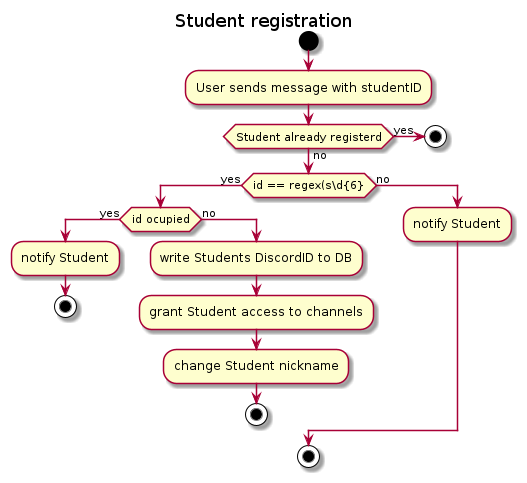

# Registration bot

Usecase: Register or unregister students to grant them permission to the discord channels.

+ The bot sits in the registration room and receives messages. 
+ All messages will be deleted after 5 seconds
+ If the message has a valid ID format then the bot will check if a student with this ID exists in the database
+ If the ID is validated correcly and the ID is not already registered to another discordUser then the bot will register the discordUserID to the Student in the database, and change the discordUserNickName to `studentFirstName - studentID` and add the discordUser to the discordRole `Student` which will give the student permission to see the hidden channels in the server.
